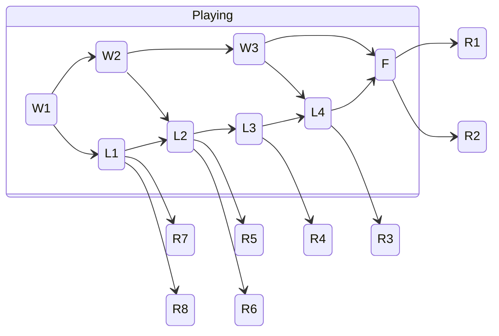

# Our Project
The 2024 FRC game, Crescendo, was home to many unforeseen upsets where statistics and prediction models proved no match for strategic masterpieces from seemingly underpowered alliances. For us, this sentence carries some salt having recently lost the World Championship in convincing fashion to an alliance that was predicted to lose every match on Einstein. This observation led us to the question: Do certain FRC games foster upset-prone playoff brackets?

## Constructing Hypotheses
While the above question motivates the steps to follow, it lacks specificity on exactly what we want to measure. To establish a clear direction, we state the following null and alternative hypotheses for each FRC game from the last five years:

**Null Hypothesis:** The outcomes of playoff brackets from this game do not significantly deviate from the expected bracket outcomes. <br/>
**Alternative Hypothesis:** The outcomes of playoff brackets from this game do significantly deviate from the expected bracket outcomes.

## Procedural Design
The end goal is to conduct a 1-sample $z$-test for the population proportion of upset brackets to determine if a specific game is upset-prone. But first, we must operationally define what an upset bracket is and devise a methodology for collecting data on such brackets. We start with the first task:

**Upset Bracket:** An upset bracket is a bracket whose final rankings have a cumulative probability of less than 50% occurrence. In other words, of all possible bracket outcomes, if the sum of all probabilities of brackets less extreme than the one that occurred is 50% or more, we consider the bracket to be an upset.

### The Probability

There are two levels to designing a probability model suitable for evaluating brackets:

**Match Probability:** We must be able to take any two alliances from a playoff bracket and determine the probability of each winning based on readily available metrics. Even if the two alliances never played each other in a real match, the outcome of a hypothetical match between the two is important in determining the next step. <br/>
**Bracket Distribution:** With match probabilities between any two alliances known, we need a way to simulate each bracket outcome and create a distribution to compare the event's final rankings with.

#### Match Probability Methodology
To calculate the outcome probability between any two hypothetical alliances, we utilize the EPA (expected points added) metric and average qualification match scores for each team in an alliance. For simplicity, we assume that alliances only play with their first three teams if a fourth exists via a backup bot or through an alliance structure in a championship event. How we derive match probability is as follows:
1. Calculate the expected score of an alliance. For this, we simply sum the EPAs of the teams in the alliance:
```python
for team in alliance.teams:
  AVG_SCORE += team.EPA
```
2. Calculate the standard deviation of an alliance's expected score. This one was a bit more complicated, but the math performed is below:
```python
for team in alliance.teams:
  VAR_SCORE += (pow(team.EPA / team.AVG_QUAL_SCORE, 2) * pow(team.SD_QUAL_SCORE, 2) / (NUM_QUAL_MATCHES - 1))
SD_SCORE = math.sqrt(VAR_SCORE)
```
3. Run 1000 simulations of a hypothetical matchup and return the probability of the match outcome. To do this, we select random values from two $t$-distributions that represent the probability models of two alliances' scores based on their mean and standard deviation calculated above. We then track which alliance won each of the 1000 matchups and take the proportion of wins by the red alliance as the return value.

To test the validity of our probability metric, we compared it to the [Statbotics](statbotics.io) match probability calculations. We found that our test cases returned similar values to this model, which has proven its high predictive validity through thousands of matches.

#### Bracket Distribution Methodology
With eight alliances at each event, there are a total of $8! = 40,320$ possible outcomes. The distribution we aim to create for each event is a skewed distribution that ranks the probability associated with each outcome from high to low. The idea behind this is that the highest probabilities are the ones with the least upsets, or where matches are won by teams predicted to win those matches. The lower probabilities on the other end of the distribution represent a more upset bracket, or where teams that were not predicted to win ended up winning more. We then insert the actual outcome of the bracket in this distribution and use the previously mentioned methods to determine if the bracket was upset.

[INSERT GRAPHIC HERE]

However, calculating all possibilities requires intensive computation, so we devised an algorithm to speed up the process. Throughout the following explanation, we make use of mathematical proofs to support our steps. Before diving in, we hope to establish a common notation. Let $p_{X}$ be the probability of an arbitrary ranking occurring, which is specified by the event $X$. We let $O$ be the true outcome of the event, which corresponds to a probability $p_{O}$. We similarly define $c_{O}$ and $c_{X}$ as cumulative probabilities. When dealing with probabilities for the outcome of specific rank $n$, we use the notation $p_{X,n}$ for any event $X$. The steps of the algorithm are as follows:
1. Represent the outcome in the form of an array: `final_rankings = [2, 1, 3, 7, 6, 5, 4, 8]`. The values in the array represent the alliance seed, while the indices represent the finishing place. Notice that in FRC playoff brackets, there will be a tie for 7th and 8th place as well as a tie for 5th and 6th place. To settle these ties, we use a secondary comparison of the average match score for each alliance through the playoffs.
2. Calculate the probability of the given ranking occurring. To do this, we iterate over all matchup possibilities that can lead to the given outcome. Then, based on the summed probabilities of each possibility, we assign the outcome a probability value.
3. Determine the cumulative probability of the event outcome $(c_{O})$. To do so, we first check to see if the outcome probability is above $\frac{2}{8!}$. If it is, then we know it must not be an upset. The proof is as follows:
  
   $$p_{O} \geq \frac{2}{8!} \implies p_{X} \geq \frac{2}{8!} \forall p_{X} \in \\{p_{X} \mid c_{X} > c_{O}\\}.$$

   So, if $c_{X} > \frac{1}{2}$, then $\sum p_{O} > 1$, which is impossible.

   For subsequent steps, consider the state diagram below. We have "playing" states where alliances are still in the event, with $W_{n}$ denoting the $n$-th upper bracket game and $L_{n}$ denoting the $n$-th lower bracket game. As the event progresses, teams transition to new playing states before eventually landing on a "ranking" state, $R_{n}$ denoting the $n$-th rank.



4. Consider the outcomes of the $W_{1}$ and $L_{1}$ states in generating $(O, 7)$ and $(O, 8)$ compared to possible $(X, 7)$ and $(X, 8)$. We claim that if $p_{O,7,8} < p_{X,7,8}$ for a given $W_{1}$ outcome, then $p_{O} < p_{x}$ once all states have been traversed.

Once we can determine, with certainty, whether an outcome is an upset, no further calculations are needed. Terminating this process while completing as few calculations as possible ensures that the calculation time is minimal.
